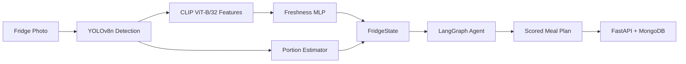

# 🥗 NutriScan — Agentic Nutrition Planner

End-to-end AI system that scans fridge photos, estimates food freshness and portions, and plans meals using a stateful LangGraph agent — all behind a production-grade FastAPI service.

## What It Does

- **Freshness regression** — CLIP ViT-B/32 frozen features → MLP regressor with MC Dropout uncertainty estimates (test MAE: 0.0025)
- **Portion estimation** — YOLOv8n detection → geometric depth proxy → gram estimates with reference-object calibration
- **Meal planning agent** — 7-node LangGraph state machine scoring 30 recipes against macro deficit and fridge freshness

## Architecture



## Tech Stack

| Layer | Technology |
|-------|-----------|
| Language | Python 3.11+ |
| Package manager | [uv](https://docs.astral.sh/uv/) |
| CV backbone | CLIP ViT-B/32 (frozen, `open-clip-torch`) |
| Object detection | YOLOv8n (`ultralytics`) |
| Regression head | MLP with MC Dropout |
| Agent framework | LangGraph + langchain-core |
| API | FastAPI + async PyMongo |
| Database | MongoDB 7 |
| Testing | pytest + httpx |
| Linting | ruff + mypy (strict) |

## Quickstart

```bash
git clone https://github.com/rakshitha-manoj/NutriScan.git
cd NutriScan
uv sync --all-extras --dev

# Download dataset & train freshness model
uv run python -m data.download
uv run python -m models.freshness.preprocess
uv run python -m models.freshness.train

# Start MongoDB & API
docker-compose up -d mongo
uv run uvicorn api.main:app --reload

# Health check
curl http://localhost:8000/health
```

## API Reference

| Method | Path | Description |
|--------|------|-------------|
| GET | `/health` | Service health check |
| POST | `/fridge/analyse` | Analyse a fridge image |
| POST | `/plan/daily` | Generate a daily meal plan |

## Demo

```bash
uv run python demo.py
```

Two-tab Gradio interface: **Fridge Analyser** (upload image → portions + freshness) and **Meal Planner** (offline recipe scoring, no MongoDB required).

## Project Structure

```
NutriScan/
├── api/                    # FastAPI service
│   ├── main.py             # App factory + lifespan
│   ├── dependencies.py     # DI singletons (DB, models)
│   ├── schemas.py          # Pydantic v2 API schemas
│   ├── settings.py         # Config from env
│   └── routes/             # health, fridge, plan
├── agent/                  # LangGraph meal planner
│   ├── graph.py            # StateGraph + run_agent
│   ├── nodes.py            # 7 graph nodes
│   └── tools.py            # Scoring, macro deficit, DB helpers
├── models/
│   ├── freshness/          # CLIP → MLP freshness regressor
│   └── portion/            # YOLOv8n → geometric gram estimator
├── db/                     # MongoDB schemas + session manager
├── data/recipes.json       # 30-recipe corpus
├── docs/benchmark.md       # Model evaluation report
├── notebooks/              # Training, estimation, agent, eval
├── demo.py                 # Gradio demo
├── tests/                  # 56+ unit tests, integration tests
└── pyproject.toml          # uv-managed dependencies
```

## Results

| Bullet | Implementation | Key Metric |
|--------|---------------|------------|
| Freshness regression | CLIP ViT-B/32 + MLP | Test MAE: 0.0025 |
| Portion estimation | YOLOv8n + geometric depth proxy | Qualitative |
| LangGraph agent | 7-node state machine | 30-recipe corpus |

See [`docs/benchmark.md`](docs/benchmark.md) and [`notebooks/05_evaluation.ipynb`](notebooks/05_evaluation.ipynb) for full evaluation.

## Phase Checklist

| Phase | Description | Status |
|-------|------------|--------|
| **0** | Project scaffold, CI, Docker, schemas, health endpoint | ✅ |
| **1** | Freshness regression model (CLIP features → expiry) | ✅ |
| **2** | Portion estimation pipeline (bbox → grams) | ✅ |
| **3** | LangGraph agent (macro tracking, recipe scoring) | ✅ |
| **4** | Full API routes + MongoDB CRUD | ✅ |
| **5** | Evaluation, benchmark report, Gradio demo | ✅ |

## License

MIT
